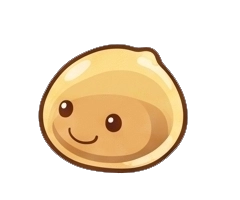
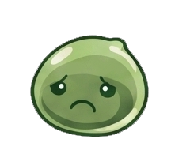

# local-vision

A small Python service that watches a video stream and asks a local
vision-language model a yes/no question about each sampled frame. No cloud
APIs — vision processing is fully local. It then turns the stream of
yes/no answers into trigger events you can act on.

The demo tracks water consumption at a desk: it fires a "positive" event
when someone reaches for a water bottle, and a "negative" event when no
drink has happened for a while.




The little blob is the visual feedback channel — happy/orange when things
are on track, sad/green when the user is overdue for the tracked
behaviour, with a color pulse on each positive trigger.

## What's here

- **Web UI** at `/` — a single page with two modes:
  - **Prepared demo** — plays a synthetic loop of two short clips
    (typing × random 2-4 → typing + bottle grab → repeat) with a
    pre-configured "drinking water" observation
  - **Upload a video** — drop a file, type any observation, configure the
    trigger
- **Trigger evaluator** with two complementary modes:
  - *Positive trigger* — fires when the observed condition has been true
    for ≥ N seconds (debounced, rising-edge)
  - *Negative trigger* — fires when no positive has fired for N seconds
    (the blob goes sad/green); re-arms on the next positive
- **Animated sprite** (orange/green poring) as the visual signal, driven
  by CSS sprite-strip animation
- **SQLite event log** persisting both per-frame observations and trigger
  fires

## Models

- **[Gemma 4 E2B-it](https://huggingface.co/google/gemma-4-E2B-it)** —
  Google's on-device multimodal model (2.3B effective params via
  per-layer embeddings). Image + text in, short text out.
- Served locally by **[Ollama](https://ollama.com)** via its
  `gemma4:e2b` tag.

## Asset sources

- **Sprite sheets** in `resources/` are derived from the classic
  Ragnarok Online "Poring" sprite (the pink original is the unmodified
  source; orange and green are re-colored variants with sad/happy faces).
- **Sample videos** in `video-samples/water-desk-parts/` are my own
  recordings — two 8-second clips at 720p that the prepared mode stitches
  together.
- **Generated assets** in `resources/generated/` (sprite strips,
  standalone WebP/WebM/APNG, first-frame stills) are built from the
  source sheets via small one-off scripts and committed for convenience.

## How to run

**Requirements**

- macOS arm64 or Linux. *If on Apple Silicon, make sure Ollama is the
  native arm64 build — installing it via Intel Homebrew runs it under
  Rosetta and inference becomes 15× slower.*
- Python 3.11+
- [`uv`](https://docs.astral.sh/uv/) for dependency management
- [Ollama](https://ollama.com) installed and running

**Setup**

```bash
# 1. Pull the model (~7 GB)
ollama pull gemma4:e2b

# 2. Install Python deps in a venv
uv sync

# 3. Start the app
uv run uvicorn local_vision.app:app --host 127.0.0.1 --port 8765

# 4. Open the UI
open http://localhost:8765
```

Then click **Start observation** in the prepared demo to see the loop
play. Roughly every 30-40 seconds (when the synthetic part-2 plays)
you'll see the bottle-grab moment, the poring color-pulses, and a row
appears in the event log. After 20s without a drink, the poring turns
green/sad.

## Layout

```
local-vision/
├── src/local_vision/
│   ├── app.py                  ← FastAPI entrypoint
│   ├── pipeline/
│   │   ├── source.py           ← VideoSource Protocol: FileVideoSource + SyntheticLoopSource
│   │   ├── sampler.py          ← async orchestrator (source → decider → trigger → events)
│   │   ├── vision_client.py    ← Ollama HTTP client for Gemma 4
│   │   ├── decider.py          ← prompt template + yes/no parsing
│   │   └── trigger.py          ← positive + negative trigger evaluators
│   ├── store/events.py         ← SQLite event log (aiosqlite)
│   └── web/
│       ├── routes.py           ← HTTP + SSE endpoints
│       ├── static/             ← app.css, app.js, poring.css
│       └── templates/index.html
├── resources/                  ← sprite sheets + generated assets
├── video-samples/water-desk-parts/  ← the two clips used by the prepared demo
├── scripts/
│   ├── smoke_test.py           ← verifies Ollama is reachable + reports per-frame latency
│   └── synthetic_water_test.py ← CLI version of the prepared demo (no browser)
├── preview-poring.html         ← static page previewing the sprite assets/formats
└── pyproject.toml
```

## Performance notes (M3 Max, native arm64 Ollama)

- ~0.7 s per multimodal frame at 640×360 input
- Default sampling: 1 Hz — comfortable real-time playback with headroom
- Counter and event log update via Server-Sent Events
